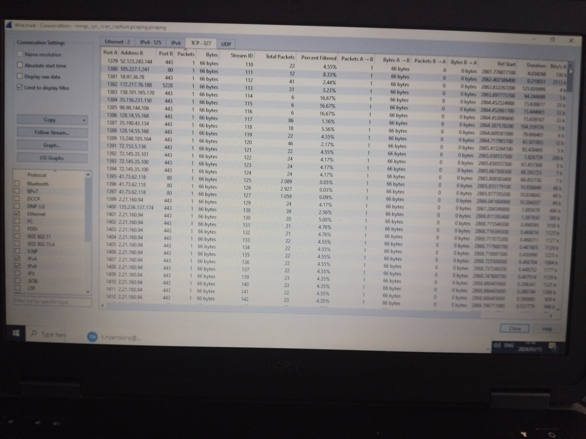

# Wireshark Nmap SYN Scan Detection Lab

## Objective
Detect and analyze a SYN scan generated by Nmap using Wireshark packet analysis.

## Tools Used
- Wireshark
- Nmap
- Kali Linux
- VirtualBox

## Method
1. Generated a SYN scan using:
   nmap -sS 10.0.2.2

2. Captured network traffic using Wireshark.

3. Applied packet filter:
   tcp.flags.syn == 1 and tcp.flags.ack == 0

4. Exported filtered packets to isolate SYN scan activity.

## Findings
- Multiple SYN packets were observed targeting different ports.
- TCP handshake was not completed, confirming SYN scan behavior.
- Wireshark conversation statistics confirmed repeated connection attempts.

## Evidence
### SYN Packet Detection

### Conversation Statistics

## Conclusion
The activity observed matches typical reconnaissance behavior where an attacker scans a host to identify open ports before launching further attacks.
